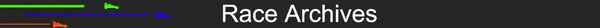
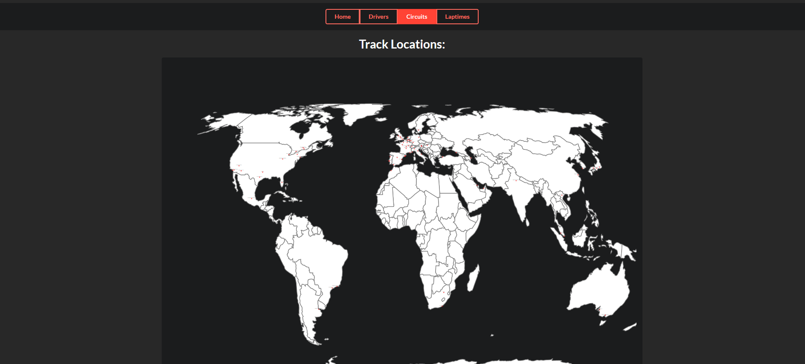

# Race Archives

# Features

- Lists of drivers and circuits with links to their wiki pages.
- A pannable, zoomable world map with circuit locations.
- Selections of circuits, years, and laptimes with tables.

## Installation

Dependencies:
Do npm install within the frontend and backend folder to generate the node modules.
SQL server: Import db.sql.

## Running
If on windows click start.bat, else reference the commands within the bat.

Connecting node to the SQL server:

Configure your connection within index.js in the backend folder.

### Some snapshots:

